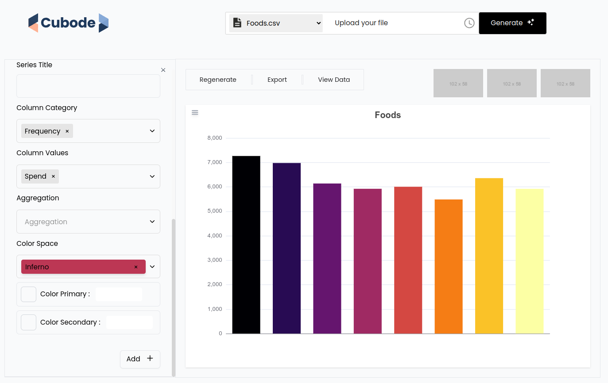

# Cubode Front-End AI Agent

Cubode Front-End AI Agent is a web application interface connected to the Cubode AI Agent Django backend. It uses Webpack for module bundling and builds a seamless interaction with the backend services.



## Installation

1. Clone this repository to your local machine using:

   ```bash
   git clone https://github.com/your_username/cubode-frontend.git

2. Navigate to the project directory:

   ```bash
   cd cubode-frontend
   
3. Install the dependencies:
   ```bash
   npm install

4. Build the project using Webpack:

   ```bash
   npm start

Open your web browser and navigate to http://localhost:9000 to access the Cubode Front-End AI Agent application.

## Development Conventions

- variables, attributes: Use camelCase for variable names

- Functions, Methods: functionNames() camelCase() for functions

- events: camelCase, on followed by the event type. onClick, onChange

- CONSTANTS: UPPERCASE, DEFAULT_TIMEOUT

- Classes & Components: PascalCase

- html-ids & css-classes: kebab-case

## API
The Cubode AI Agent  application interacts with the following endpoints provided by the external API:
- **User Login**
  - Endpoint: `....`
  - Description: Authenticates a user and returns a token.. 
- **User Registration**
  - Endpoint: `.....`
  - Description: Registers a new user and returns user details.
- **File Upload**
  - Endpoint: `.....`
  - Description: Allows users to upload files to the server.
For detailed API documentation, refer to [API Documentation](###).

## Contributing
Contributions to Cubode AI Agent are welcome! To contribute:
1. Fork this repository.
2. Create a new branch for your feature: `git checkout -b feature/your-feature-name`.
3. Make your changes and commit them: `git commit -m "Add your commit message here"`.
4. Push to your branch: `git push origin feature/your-feature-name`.
5. Create a pull request detailing your changes.

## License
This project is licensed under the MIT License.
Feel free to reach out to us if you have any questions or feedback. Happy coding!
Project maintained by [Cubode LTD ](####).

